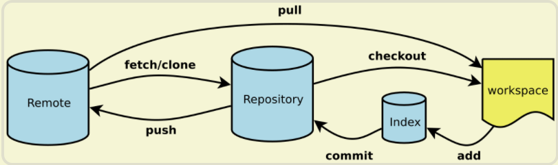

## Git常见命令
阮一峰常见命令清单：https://www.ruanyifeng.com/blog/2015/12/git-cheat-sheet.html

### 一、新建代码库
```shell
# 在当前页面新建一个Git代码库
$ git init

# 新建一个目录，将其初始化为Git代码库
$ git init [project_name]

# 下载一个项目和他整个代码历史
$ git clone [url]
```
