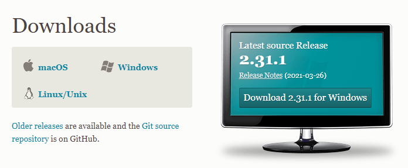
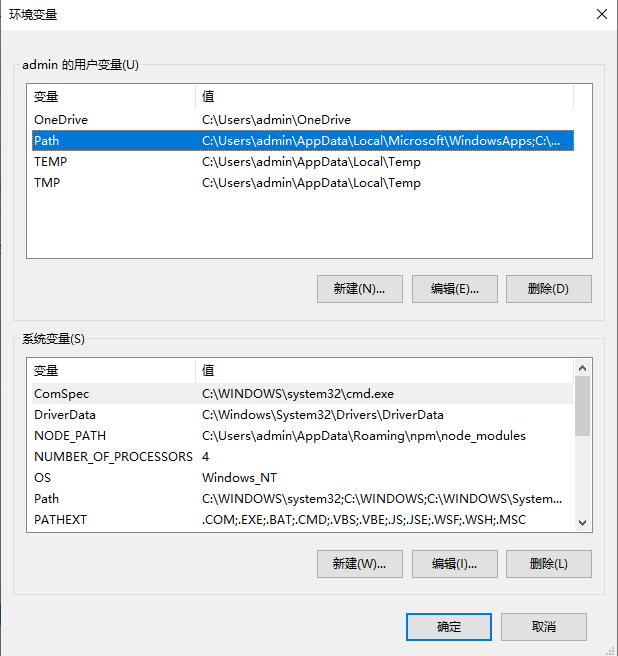
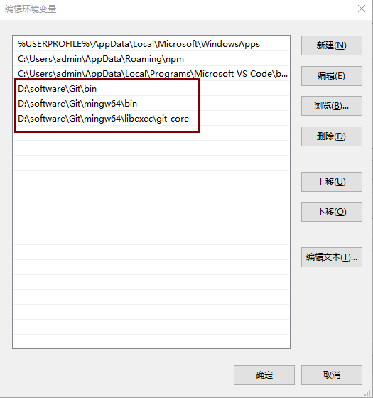
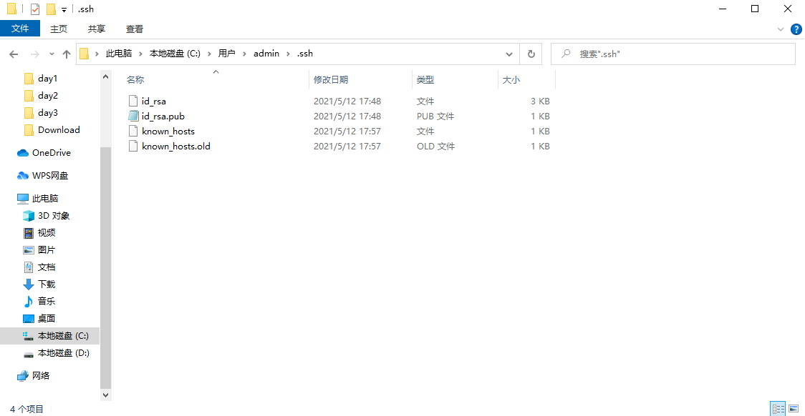
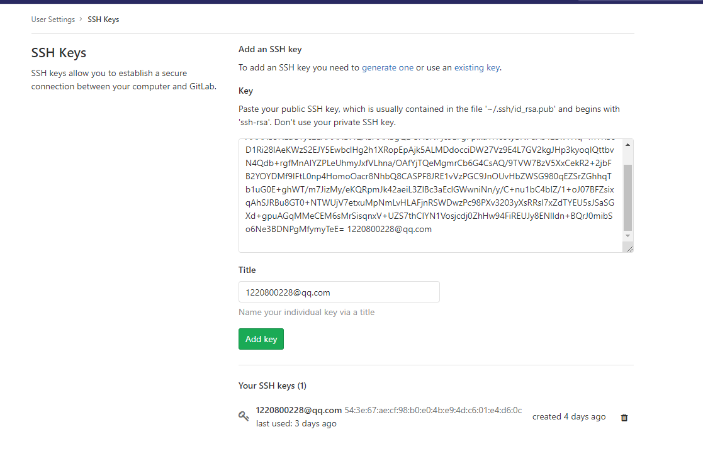

### git下载与安装
- git下载地址：https://git-scm.com/download

安装完成后，可以在开始菜单栏中看到三个启动图标：Git Bush、Git CMD、Git GUI
### git环境配置
- 右键我的电脑-->高级系统设置-->环境变量-->编辑Path


### SSH公钥
- 设置用户名和邮箱
```shell
git config --global user.name "HeJieting"
git config --global user.email "1220800228@qq.com"
```
- 生成密钥对
```shell
ssh-keygen -t rsa -C "1220800228@qq.com"
```
此时在指定的保存路径下会有一个.ssh文件夹

- 打开GitLab-->设置-->SSH Keys-->将id_rsa.pub中的公钥复制粘贴过来-->Add key

